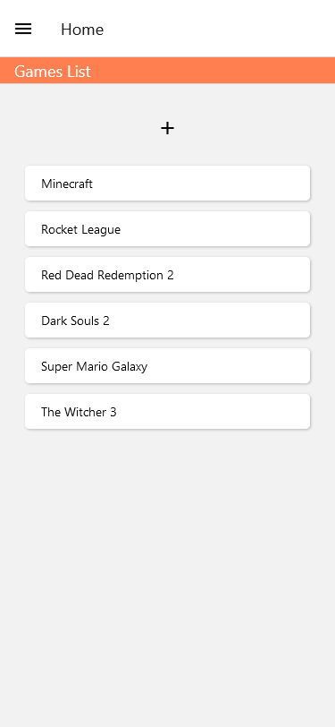
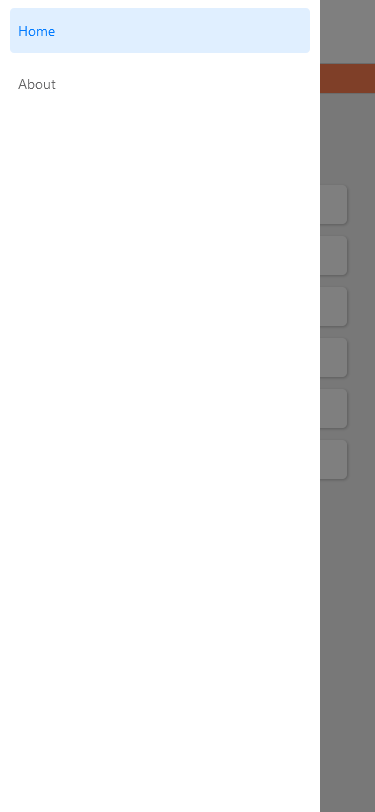

# Review App using React Native 📌

## What is it? 📝

A basic review app created with Expo a React Native framework. I used [React Navigation](https://reactnavigation.org/) for the transition between screens and [Formik](https://formik.org/) with [yup](https://github.com/jquense/yup) to create a form and validate data in the form.

## Screenshots 📷







## What did I learn? 🤔

**I have learned a lot working on this project and used multiple methods and libraries to make it work.**

**I will explain the things I learned with a brief explanation of what they are and how to use them in the list below 👇**

- [AppLoading](https://docs.expo.dev/versions/latest/sdk/app-loading/) - This component is used to keep the splash screen visible while the app is loading.

```js
<AppLoading />
```

- [useFonts](https://docs.expo.dev/versions/latest/sdk/font/) - Allow us to use any type of font in our App. I downloaded the fonts I used in the project from [Google Fonts](https://fonts.google.com/).

```js
let [fontsLoaded] = useFonts({
  'font-name-regular': require('./assets/fonts/font-name-regular.ttf'),
  'font-name-bold': require('./assets/fonts/font-name-bold.ttf'),
})
```

- [Stack Navigator](https://reactnavigation.org/docs/hello-react-navigation) - Stack Navigator provides a way for our App to transition between screens. And to use the stack navigator we need to import `createStackNavigator` which is a function that takes 2 properties: `Screen` and `Navigator` both of which react components that we used to configure our navigator.

1. `NavigationContainer` - This is a component that manages our navigation tree and must wrap all the navigation structures.
1. `Navigator` will wrap the `Screen` elements as children to configure the routing.
1. `Screen` elements will have the `name` property which can be the name of the screen we want to show and `component` which is the actual screen component we want to show we are in this route.

```js
import { createStackNavigator } from '@react-navigation/stack'

const Stack = createStackNavigator()

function Navigator() {
  return (
    <NavigationContainer>
        <Stack.Navigator initialRouteName='Home'>
            <Stack.Screen
            name='Home'
            component={Home}
            options={{ title: 'Main Page' }}
            />
            <Stack.Screen
            name='ReviewDetails'
            component={ReviewDetails}
            options={{ title: 'Main Page' }}
            />
        </Stack.Navigator>
    </NavigationContainer>
})
```

- [Drawer Navigator](https://reactnavigation.org/docs/drawer-based-navigation) - A Drawer Navigation is a drawer that can be shown on the left side to navigate between screens. Work the same way as the Stack Navigator but we have to import the `createDrawerNavigator` instead.

- [Modal](https://docs.expo.dev/versions/latest/react-native/modal/) - The modal component let us present new content on top of everything.

- [Formik](https://formik.org/) - Formik is a form library for React and React Native it makes working with a form very easy. After installing formik we can use the `<Formik/>` component and it will take three two essential attributes:

1. `initialValues` - That takes the values that we are going to collect from this form.
1. `onSubmit` - This is triggered if we create a button in the form and give it the `onPress={props.handleSubmit}` and we can have the values of all the inputs from the form.

Basic Formik Code:

```js
<Formik
  initialValues={{ name: '', age: '' }}
  onSubmit={(values, action) => {
    console.log(values)
    action.resetForm() // Will reset the values to the default values:  { name: '', age: '' }
  }}
>
  {(props) => (
    <View>
      <TextInput
        onChangeText={props.handleChange('name')}
        value={props.value.name}
      />
      <TextInput
        onChangeText={props.handleChange('age')}
        value={props.value.age}
      />
    </View>
  )}
</Formik>
```

- [yup](https://github.com/jquense/yup) - For validation we used yup. In yup, we create a schema for the form and specify what each input should and should not have.

```js
// Name is required and at least 3 characters.
// Age is required and over 18.
const userSchema = yup.object({
    name: yup.string().required().min(3),
    age: yup
    .string()
    .required()
    .test('age-over-18', 'Age must be over 18', (val) => return parseInt(val) > 18)
})
```

## Resources 🔗

- [React Native Tutorial By The Net Ninja](https://www.youtube.com/playlist?list=PL4cUxeGkcC9ixPU-QkScoRBVxtPPzVjrQ) - I followed this tutorial to learn React Native.

- [React Native](https://reactnative.dev/) - React native is a framework that allows us to create mobile apps using JavaScript.

- [Expo](https://expo.io/) - Expo is a mobile app development platform that allows you to build native mobile apps for iOS and Android.

- [React Navigation](https://reactnavigation.org/) - React Navigation is a navigation library for Routing and navigation for Expo and React Native apps.

- [Formik](https://formik.org/) - Formik is a from library for React and React Native.

- [yup](https://github.com/jquense/yup) - Yup is a schema builder for runtime value parsing and validation.
